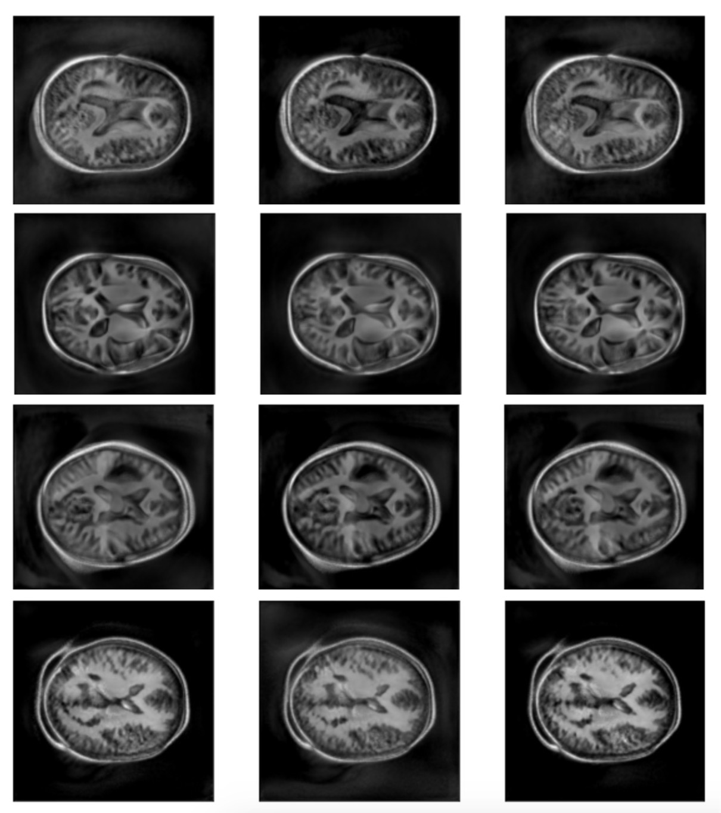

# StyleGAN2 implementation on OASIS dataset

#### Project Report
* Task 7. Create a generative model of the OASIS brain dataset using StyleGAN2.
* StyleGAN2 is based on ProGAN and StyleGAN, the basic modules in Generator include Mapping Network, Modulation and Demodulation layer.
* StyleGAN2 improved artifacts in styleGAN caused by AdaIn layer.

### Problem dicription
OASIS dataset is used for diagnosis of different brain issues or damages. This project is aim to train SytleGAN2 to generate fake images similar to the original images.

### Model Architecture
  #### Architecture of Generator
     
  * The input of generator network is a constant.
  * The generator network consis of sytleblocks. The resolution of each styleblock is doubled.
  * The output of generator network is an image, summed by each upsampled output image of styleblocks.

  ##### Modulation and Demodulation layer
  Layers in Generator are Modulation and Demodulation layer: Modulation: scales each input feature map of the convolution based on the incoming style; Demodulate each output feature map by a scale.
  ##### Mapping Network
  A 8-layers non-linear mapping network. Affine transform latent vector z to w. 
  ##### Equalized Learning Rate layer
  Initialize weights using N(0,1), dynamically renormalize the weights in each layer.
  Equalized lr ensure the lr is the same for all weights.
  ##### Bilinear filtering in all up/downsampling layers
  Apply low-pass filter between the max operator and naive subsampling as a means of anti-aliasing. 

  #### Architecture of StyleGAN2
     
  * Using skip connection in Generator and residual connection in Discriminator.
  * The Discriminator is similar to StyleGAN1.

### Result
#### Generated images in some epoches
   
Explaination: The images generated by each epoch are very similar. The possible reason is that the database has more similar images, the diversity of the data is low, and the database is relatively simple for D.
#### Experiment in the MINIST database

From the result we can see see that there are different images generated in one epoch.

### Requirments
* Python 3.7.12  
* numpy 1.19.5 
* torch 1.9.0
* torchvision 0.10.0
* tqdm 4.62.3
* matplotlib 3.2.2 

### Execute the code
* train.py is the main script to train the model;
* model.py contain Generator and Discriminator model;
* config.py contains all the necessary configure used to train the model.
* Customize the image size, change the training database root and store the sample data root, please modify config.py.

### Reference
#### Paper
* Tero Karras, Miika Aittala, Janne Hellsten, Samuli Laine, Jaakko Lehtinen, Timo Aila. Analyzing and Improving the Image Quality of StyleGAN.  
https://arxiv.org/abs/2006.06676 
* Karras, T., Laine, S., & Aila, T. A Style-Based Generator Architecture for Generative Adversarial Networks. IEEE Transactions on Pattern Analysis and Machine Intelligence.  
https://arxiv.org/pdf/1812.04948.pdf 
* Karras, T., Aila, T., Laine, S., & Lehtinen, J. Progressive Growing of GANs for Improved Quality, Stability, and Variation.  
https://arxiv.org/pdf/1710.10196.pdf 
* Richard Zhang. Making Convolutional Networks Shift-Invariant Again.  
https://arxiv.org/abs/1904.11486 

#### Code
* https://github.com/NVlabs/stylegan2-ada-pytorch 
* https://github.com/adobe/antialiased-cnns/blob/master/antialiased_cnns/blurpool.py 
* https://github.com/lucidrains/stylegan2-pytorch/blob/1a789d186b9697571bd6bbfa8bb1b9735bb42a0c/stylegan2_pytorch/stylegan2_pytorch.py 
* https://github.com/facebookresearch/pytorch_GAN_zoo 
